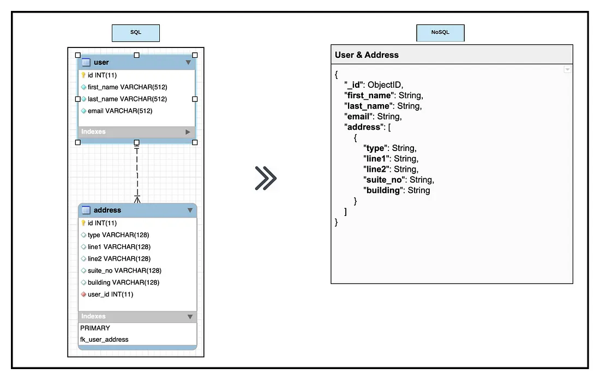

# Understanding NoSQL

The concept of NoSQL (also known as Not Only SQL) is an alternative to SQL (Structured Query Language). However, despite the name, NoSQL doesn't completely throw out the concept of structure in how its presented - implied by its alias. The concept is more to have a freeform, dynamic design while addressing some of the more troublesome parts of regular SQL. 

## Comparing SQL and NoSQL
In general, we can summarise the comparisons between SQL and NoSQL into a table.


|Feature     |SQL                   |NoSQL                     |
| ------     | ------               | ------                   |
|Type        |Relational            |Non-Relational            |
|Languages   |MySQL, SQLServer, etc.|Python, C#, MongoDB, etc. |
|Design      |"Table Design"        |Dynamic                   |
|Scalability |Vertical              |Horizontal                |

By non-relational, we mean a form of database storage that does not rely on them being associated with primary and foreign keys or (specifically) tables, concepts more attributed to relational databases. Design (or schema design) is the form it takes in visualising the concept. SQL is has a "table design" because upon looking at information within SQL it presents itself as just that, tables. NoSQL on the other hand has a lot more forms it can take, which we will look into, along with the differences in scalability and what this means. NoSQL ends up being great for JSON and data, stuff that appears more unstructured, whereas SQL is always best still for stuff that needs that extra structure to function correctly - perhaps a fixed list of chain locations and opening times for businesses. [1]

## NoSQL Schema Design
NoSQL can take several forms due to its dynamic nature, but one form in particular is the idea of key-value pairs. This resembles dictionaries in Python or name-value pairs for JSON. A demonstration of NoSQL in another form can be seen below, taking the form of a document.

 [2]

If it can be organised into a form as simple as this, it can work with NoSQL.

## Scalability in NoSQL

In SQL scalability is vertical, meaning a more packed load of querying and storage will need a better machine to handle the database. This is fine for a small project that can handle the higher demand, but for many cases this is unwarranted. With NoSQL, it is thankfully less stressful to increase the load of the system due to its horizontal scalability. This implies that larger work loads can be handled by separating the load amongst multiple servers in a process known as "sharding". This is great as it does end up being more efficient than getting one more powerful machine, the work that multiple servers can do ending up being more usable and getting an overall larger outcome than vertical scaling, but it can still have some caveats. For instance, servers can be quite expensive still (even if cheaper than the alternative), plus the need to have all these servers connected in some form can be annoying when newer servers will have to find a way to communicate with older models, along with the allocation of what exactly each server will do for different segments. To many though, these downsides are nothing compared to the hassle of maintaining information on a single system. [3], [4]

A horizontal form of scalability is sometimes just referred to as "scalable", which does make sense when you consider how much less restrictive this set-up is compared to vertical scaling.

## NoSQL Databases

NoSQL is a way of presenting databases that can take many forms. It can be as simple as the aforementioned key-value pairs, or it can be closer to the form of SQL (tables). The forms typically seen in various databases are:
- Key-value pairs
- Document-based (as seen in the schema design example image)
- Wide-column
- Graph
- Time series

Wide-column acts quite like a database that you might see within SQL, but with the major difference that columns are used to house the data rather than rows. Columns that are connected are under a collected "column family", meaning there is a connection in their attributes where this is necessary.

The graph form has a use of nodes connecting points of the data that have a specific relationship within the database. This is one of the more complex forms of NoSQL, yet it still serves the same purpose. Whatever form of the database is chosen all depends on what is most viable for the project. [5]


## MongoDB
While perhaps not the preferred choice for many, this introduction to NoSQL will now go through introducing MongoDB, a database product for NoSQL which mainly focuses on the document form of NoSQL databases. Some things MongoDB does are similar, though not exactly the same, to how SQL does them. For example, in SQL multiple groups of data are separated and labelled via tables. MongoDB can also do this for organisation, but instead of tables it uses what are known as "collections". The document form of NoSQL that MongoDB utilises also simply allows for these documents it uses to hold within them all related data, resulting in what should be a faster reading speed for data as opposed to the tabular structure of SQL. [6]

## The Architecture of MongoDB
MongoDB is structured in a particular way to theoretically get the best efficiency in performance and flexibility. In an abbreviated list, this architecture is as follows:
1. Collection - a group of documents for MongoDB
2. Document - where data is kept in MongoDB, using Binary JSON (BSON)
3. Database - where all of the collections are held
4. Shard - An application of the horizontal scaling of NoSQL, shards are used to partition data across multiple nodes (or servers)
5. Replica Set - A group of nodes or servers that hold identical data, useful for backups or if the data needs to be manipulated in various different ways
6. Query Router - Where the user (or client) has information obtained for them based on the query they input, which determines the path to the data requested and, if necessary, which shard to be directed to
7. Configuration servers - Where configuration settings for the instance of MongoDB being utilised for a database are stored

[7]

The architecture structure is possible due to a storage engine, which determines the storage of data within memory. By default, MongoDB uses what is known as the "Wired Tiger" storage engine, but the user  can also modify this to what they want if they feel an alternative is preferable. [8]

## When should MongoDB be used?

Every scenario will differ on the relevancy of using MongoDB, so it is important to know what is good and bad about it. Some advantages have been mentioned above, such as the highly scalable model of NoSQL implemented into MongoDB and the efficiency in which it can store data in documents, but compared to other choices MongoDB also boasts in its apparent simplicity of use, along with highly valuable documentation that users can access at any point online. There are, however, some drawbacks. Like in SQL, NoSQL databases might need to have joins occur within queries. MongoDB does not support the use of joins well, resulting in any potential joins that need to be made having to be done in a very tedious way, involving the duplication of data in some cases. This can also lead to another issue of high memory usage, as duplicating data just for a simple join results in memory being used up just for redundant data. This should be okay for small amounts of data, but considerably large amounts should be considered carefully before any duplication is committed for a join, as it could lead to negative system-wide consequences. There is also the chance of data corruption when transactions occur, which in MongoDB is thankfully not a common occurrence, but this does not reduce the severity of data corruption when it does happen. [9]

For this reason, you would be correct in assuming that databases which will involve a lot of joins (inner or outer) would be heavily restricted if built with MongoDB, especially if the computer required to handle it is risking a cap in memory usage (it is always better to be safe than sorry and maybe seek a computer with higher RAM included). However, if a large amount of data is present and it needs to be analysed at high speed, MongoDB's document database design should hopefully prove to be the better instance of creating a database over an SQL language.

# MongoDB exercises
Note: simple commands for MongoDB, which can be typed into the MongoDB Shell (mongosh):
- use <name_of_database>
- db.createCollection(<name_of_collection>)
- db.collection_name_here.insertOne({"key": "value"})
- db.collection_name_here.insertMany([ { "key1": "value1", "key2": "value2" }, { "key1": "value2.2", "key2": "big_value" }])
- show collections
- db.getCollectionNames()
- db.collection_name_here.find({})
- db.collection_name_here.updateOne(<insert_syntax>)
- db.collection_name_here.updateMany(<insert_syntax>)
- db.collection_name_here.deleteOne(<insert_syntax>)
- db.collection_name_here.deleteMany(<insert_syntax>)

Exercise 1:
```
db.createCollection('mongodb_intro_exercises')
db.mongodb_intro_exercises.insertOne({name: 'Grave of the Fireflies', year:NumberInt(1988), 'box office':'¥1.7 billion', 'notes': 'Japanese animation film' })
db.mongodb_intro_exercises.insertMany([{name:'John Wick: Chapter 2', year:NumberInt(2017), 'box office':'$174.3 million', notes: {genre: 'Action', lead: 'Keanu Reeves'}}, {name:'The Incredibles', year:NumberInt(2004), 'box office': '$631.6 million', notes: 'Brad Bird directs'}])
```

Exercise 2:
```
db.mongodb_intro_exercises.insertOne({name: 'To be removed', year:'This year', 'box office':'we do not have a box so let\'s just remove it', notes:'Delete this'})
db.mongodb_intro_exercises.updateOne({name:"To be removed"}, {$set: {'final verdict': 'wait a second, this isn\'t a film!'}})
db.mongodb_intro_exercises.updateOne({name:"To be removed"}, {$unset: {'final verdict': null}})
db.mongodb_intro_exercises.deleteOne({name: "To be removed"})
```

Exercise 3:
```
||/ Name                   Version      Architecture Description
+++-======================-============-============-===================================================================================
ii  mongodb-database-tools 100.9.4      amd64        mongodb-database-tools package provides tools for working with the MongoDB server: 

# Proof of installation of database tools
```

Exercise 5:
```
db.characters.find({name:"Luke Skywalker})
```

Exercise 6:
```
db.characters.find({'species.name':"Human"}, {name: 1, 'homeworld.name': 1})
```

Exercise 7:
```
db.characters.find({$or: [{eye_color:"yellow"}, {eye_color:"orange"}]})
```


#### Sources
[1] "SQL vs NoSQL: 5 Critical Differences" - https://www.integrate.io/blog/the-sql-vs-nosql-difference/

[2] "Learning NoSQL — NoSQL Database Designing" - https://medium.com/tech-tajawal/nosql-modeling-database-structuring-part-ii-4c364c4bc17a

[3] "SQL vs NoSQL Databases: Key Differences and Practical Insights" - https://www.datacamp.com/blog/sql-vs-nosql-databases

[4] "Horizontal Vs. Vertical Scaling: How Do They Compare?" - https://www.cloudzero.com/blog/horizontal-vs-vertical-scaling/

[5] "Types of NoSQL databases" - https://docs.aws.amazon.com/whitepapers/latest/choosing-an-aws-nosql-database/types-of-nosql-databases.html

[6] "MongoDB - Getting Started" - https://www.w3schools.com/mongodb/mongodb_get_started.php

[7] "MongoDB Architecture and Characteristics" - https://medium.com/techieahead/mongodb-architecture-and-characteristics-32a3798c2b49

[8] "How MongoDB Works" - https://dotnettutorials.net/lesson/how-mongodb-works/

[9] "Understanding the Pros and Cons of MongoDB" - https://www.knowledgenile.com/blogs/pros-and-cons-of-mongodb
